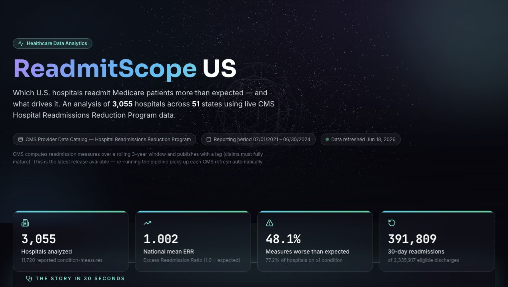
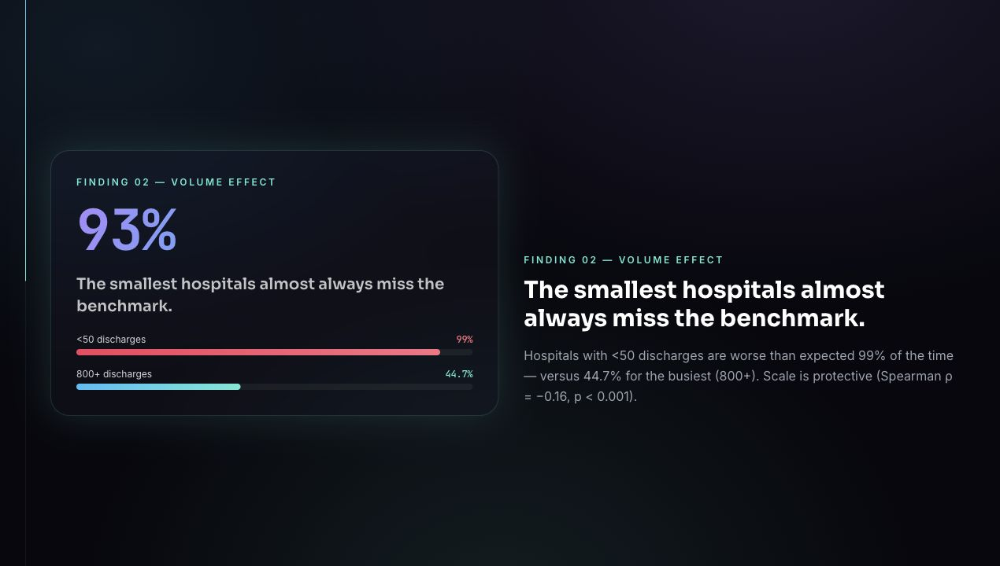
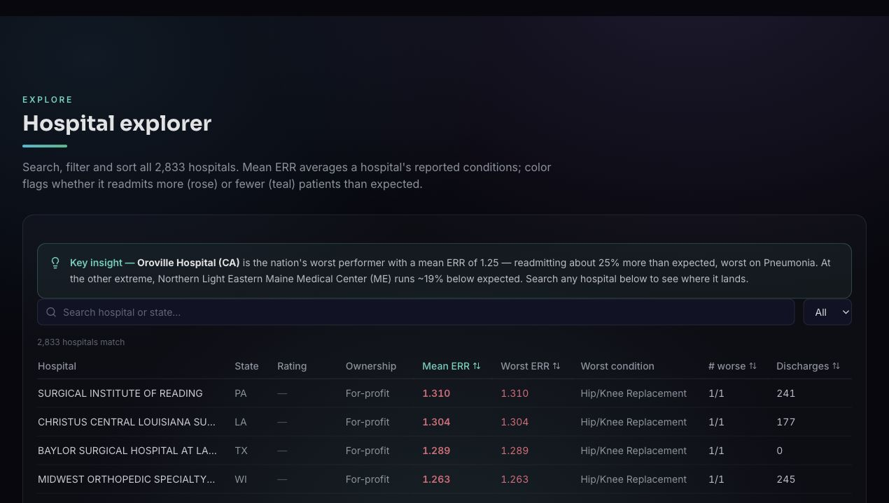

# ReadmitScope US

An end-to-end healthcare analytics project that asks: **which U.S. hospitals readmit Medicare patients more than expected within 30 days, and what patterns explain the gap?**

[Live dashboard](https://readmitscope.vercel.app)  
Data source: CMS Provider Data Catalog, Hospital Readmissions Reduction Program, FY 2026 release


## Dashboard Preview







## What This Project Shows

ReadmitScope is built as a complete analyst workflow, not just a visualization. It covers problem framing, live data acquisition, cleaning, quality checks, exploratory analysis, statistical testing, enrichment with hospital attributes, and a deployed interactive dashboard.

The core metric is **Excess Readmission Ratio (ERR)**:

- `ERR > 1.0`: hospital readmits more patients than expected after CMS risk adjustment.
- `ERR < 1.0`: hospital performs better than expected.
- ERR is useful because it adjusts for patient risk, making comparisons fairer across hospitals.

## Headline Findings

1. Excess readmissions are systemic: 48.1% of reported condition-measures are worse than expected.
2. 77.2% of hospitals exceed expected readmissions on at least one tracked condition.
3. Volume matters: small hospitals show the highest risk, with a statistically significant negative association between discharge volume and ERR.
4. Surgical and cardiac measures are slightly worse, but every tracked service line has elevated readmission risk.
5. For-profit hospitals readmit more than non-profit hospitals after risk adjustment.
6. CMS star rating is strongly ordered: 1-star hospitals perform worse far more often than 5-star hospitals.

See [docs/05_findings.md](docs/05_findings.md) for the full write-up.

## Repository Structure

| Path | Purpose |
|---|---|
| [src/fetch_data.py](src/fetch_data.py) | Pulls the latest CMS HRRP data and logs provenance. |
| [src/build_aggregates.py](src/build_aggregates.py) | Cleans, enriches, and exports dashboard-ready aggregates. |
| [notebooks/01_cleaning.ipynb](notebooks/01_cleaning.ipynb) | Cleaning workflow and suppression handling. |
| [notebooks/02_eda.ipynb](notebooks/02_eda.ipynb) | Exploratory data analysis. |
| [notebooks/03_analysis.ipynb](notebooks/03_analysis.ipynb) | Statistical analysis and hypothesis tests. |
| [notebooks/04_enrichment.ipynb](notebooks/04_enrichment.ipynb) | Ownership and CMS star-rating enrichment. |
| [docs/00_problem_statement.md](docs/00_problem_statement.md) | Project framing and analytical goal. |
| [docs/01_data_sources.md](docs/01_data_sources.md) | Source data notes and API details. |
| [docs/02_data_dictionary.md](docs/02_data_dictionary.md) | Field definitions and metric meanings. |
| [docs/03_data_quality_log.md](docs/03_data_quality_log.md) | Data quality decisions and exclusions. |
| [docs/04_decisions.md](docs/04_decisions.md) | Modeling and analysis decisions. |
| [docs/05_findings.md](docs/05_findings.md) | Executive findings. |
| [docs/assets/](docs/assets/) | Dashboard screenshots used in this README. |
| [data/processed/](data/processed/) | Reproducible processed outputs. |
| [dashboard/](dashboard/) | React, TypeScript, Vite dashboard. |
| [requirements.txt](requirements.txt) | Python dependencies for the pipeline and notebooks. |

## Reproduce The Analysis

```bash
python -m venv .venv
source .venv/bin/activate
pip install -r requirements.txt

python src/fetch_data.py
python src/build_aggregates.py
jupyter nbconvert --to notebook --execute --inplace notebooks/0*.ipynb
```

## Run The Dashboard Locally

```bash
cd dashboard
npm install
npm run dev
```

Local dashboard: `http://localhost:5181`

## Production Deployment

The dashboard is deployed on Vercel:

[https://readmitscope.vercel.app](https://readmitscope.vercel.app)

To redeploy from this workspace:

```bash
cd dashboard
vercel deploy --prod
```

## Data Source

Centers for Medicare & Medicaid Services, Hospital Readmissions Reduction Program dataset `9n3s-kdb3`.

This is public U.S. Government data. Analysis and interpretation are the author's own and do not represent CMS.

## Contributor

Built and maintained by **Pavan Venkata Manjunath Mallipudi**.

This repository is intended to show Pavan as the sole project contributor.
