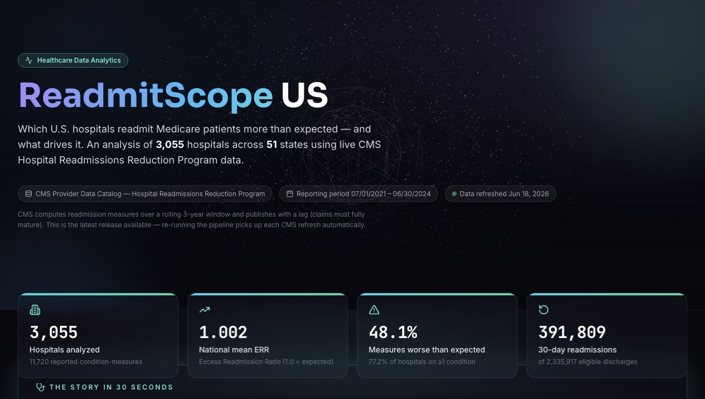
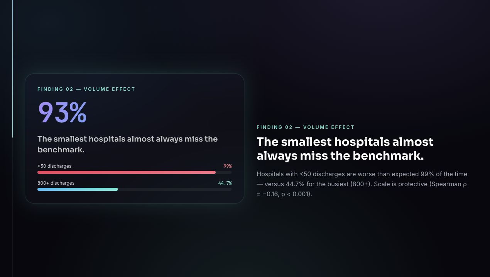
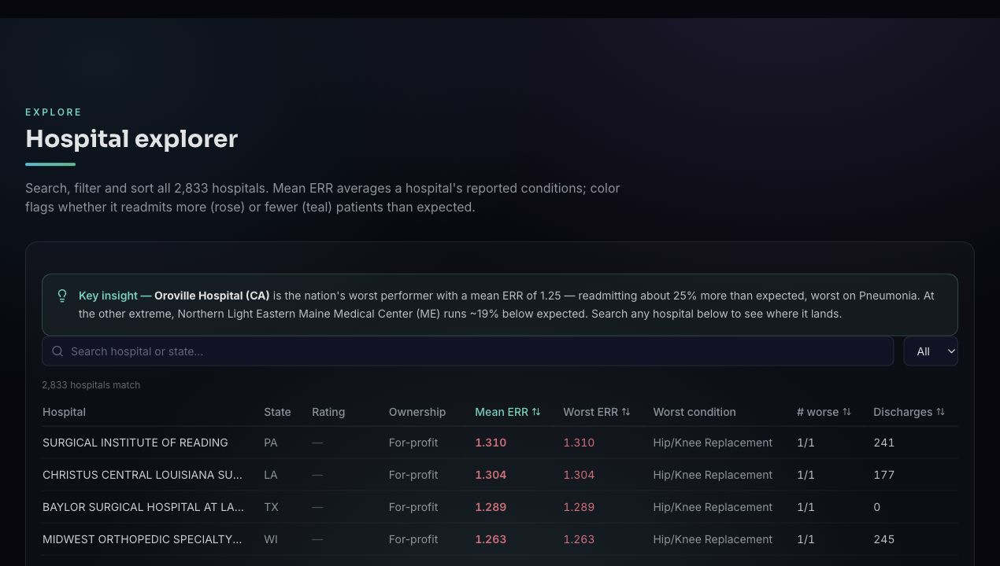

# ReadmitScope US

An end-to-end healthcare analytics project that asks: **which U.S. hospitals readmit Medicare patients more than expected within 30 days, and what patterns explain the gap?**

[Live dashboard](https://readmitscope.vercel.app)  
Data source: CMS Provider Data Catalog, Hospital Readmissions Reduction Program, FY 2026 release


## Dashboard Preview







## What This Project Shows

ReadmitScope is built as a complete analyst workflow, not just a visualization. It covers problem framing, live data acquisition, cleaning, quality checks, exploratory analysis, statistical testing, enrichment with hospital attributes, and a deployed interactive dashboard.

The core metric is **Excess Readmission Ratio (ERR)**:

- `ERR > 1.0`: hospital readmits more patients than the national-average hospital would with the same patients.
- `ERR < 1.0`: hospital performs better than expected.
- ERR adjusts for clinical case mix, making comparisons fairer across hospitals. Because the benchmark is the national average, about half of all measures sit above 1.0 by construction, so every finding here is compared against what chance would produce.

## Headline Findings

1. **Readmission performance is a hospital-level trait.** 9.2% of hospitals are worse than expected on every reported condition, about twice the 4.7% chance would give. ("Most hospitals are worse on at least one condition" is expected by construction.)
2. **The "small hospitals do worst" pattern is a reporting artifact.** CMS only publishes counts when readmissions are 11 or more. Once that is accounted for, volume has no detectable effect (−0.05 ERR points per doubling, 95% CI −0.34 to +0.25).
3. **No condition stands out.** All six sit between 47% and 50% above 1.0; surgical and medical measures do not differ (paired p = 0.58).
4. **Star rating tracks readmissions strongly** (★1 +4.0 ERR points vs ★3, ★5 −4.0), partly by construction because the rating includes readmission measures.
5. **The for-profit gap is small once rating and state are considered** (+0.4 points, p = 0.08).
6. **Seven states are significantly above 1.0** (led by NJ and MA) and twelve below, ranking only states with 10 or more reporting hospitals.

Tests use one value per hospital or hospital-clustered standard errors, because measures from the same hospital are correlated.

See [docs/05_findings.md](docs/05_findings.md) for the full write-up.

## Repository Structure

| Path | Purpose |
|---|---|
| [src/fetch_data.py](src/fetch_data.py) | Pulls the latest CMS HRRP data and logs provenance. |
| [src/build_aggregates.py](src/build_aggregates.py) | Cleans, enriches, runs the statistical tests, and exports dashboard-ready aggregates. |
| [src/stats_utils.py](src/stats_utils.py) | Confidence intervals and hospital-clustered OLS used by the pipeline. |
| [tests/](tests/) | Pytest suite for the cleaning and statistics code. |
| [.github/workflows/ci.yml](.github/workflows/ci.yml) | CI: runs the tests and type-checks/builds the dashboard on every push and PR. |
| [notebooks/01_cleaning.ipynb](notebooks/01_cleaning.ipynb) | Cleaning workflow and suppression handling. |
| [notebooks/02_eda.ipynb](notebooks/02_eda.ipynb) | Exploratory data analysis. |
| [notebooks/03_analysis.ipynb](notebooks/03_analysis.ipynb) | Statistical analysis and hypothesis tests. |
| [notebooks/04_enrichment.ipynb](notebooks/04_enrichment.ipynb) | Ownership and CMS star-rating enrichment. |
| [docs/00_problem_statement.md](docs/00_problem_statement.md) | Project framing and analytical goal. |
| [docs/01_data_sources.md](docs/01_data_sources.md) | Source data notes and API details. |
| [docs/02_data_dictionary.md](docs/02_data_dictionary.md) | Field definitions and metric meanings. |
| [docs/03_data_quality_log.md](docs/03_data_quality_log.md) | Data quality decisions and exclusions. |
| [docs/04_decisions.md](docs/04_decisions.md) | Modeling and analysis decisions. |
| [docs/05_findings.md](docs/05_findings.md) | Executive findings. |
| [docs/assets/](docs/assets/) | Dashboard screenshots used in this README. |
| [data/processed/](data/processed/) | Reproducible processed outputs. |
| [dashboard/](dashboard/) | React, TypeScript, Vite dashboard. |
| [requirements.txt](requirements.txt) | Python dependencies for the pipeline and notebooks. |

## Reproduce The Analysis

```bash
python -m venv .venv
source .venv/bin/activate
pip install -r requirements.txt

python src/fetch_data.py
python src/build_aggregates.py
pytest
jupyter nbconvert --to notebook --execute --inplace notebooks/0*.ipynb
```

## Run The Dashboard Locally

```bash
cd dashboard
npm install
npm run dev
```

Local dashboard: `http://localhost:5181`

## Production Deployment

The dashboard is deployed on Vercel:

[https://readmitscope.vercel.app](https://readmitscope.vercel.app)

To redeploy from this workspace:

```bash
cd dashboard
vercel deploy --prod
```

## Data Source

Centers for Medicare & Medicaid Services, Hospital Readmissions Reduction Program dataset `9n3s-kdb3`.

This is public U.S. Government data. Analysis and interpretation are the author's own and do not represent CMS.

## Contributor

Built and maintained by **Pavan Venkata Manjunath Mallipudi**.

This repository is intended to show Pavan as the sole project contributor.
